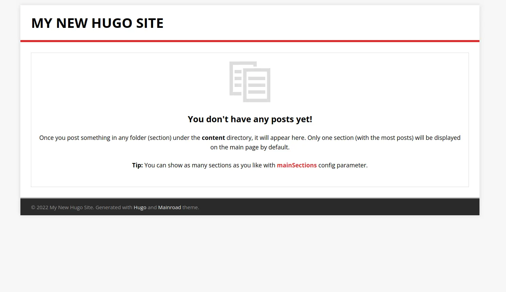

皆さんこんにちは、Sandy マンです！

突然ですが、皆さんは「ブログを作りたい」と思ったことはありませんか？（唐突）ありますよね？？ですが、WordPress で作ると、ドメイン代＋サーバー代がかかってしまいます...。そんなときの救世主がそう、**静的サイトジェネレータ**です！

ということで、今回は静的サイトジェネレータ（以下 SSG）である Hugo を使ってでブログを作っていきます！それではやっていきましょう！

## 実施環境

- OS Linux 5.18（Manjaro）

## 1.環境構築

まず、Hugo のパッケージをインストールします。Linux 環境の方は、`sudo apt install hugo`という感じでインストールできます。

Windows や Mac の方は、Chocolatey や HomeBrew？とかを使っていい感じにやってください。（要は ggrks）

## 2.ブログの作成

それでは、ブログを作っていきます！ターミナルを開いて、`hugo new site myblog`というコマンドを実行します。（myblog のところは自由に変えてください）
すると、`myblog`というフォルダ内にいろいろファイルが生成されたはずです！これで一応ブログはできました！

## 3.テーマの追加

ですが、これだけだとブログとして使い物になりません。なぜかというと、レイアウトを整えたりする「テーマ」がないからです。テーマは自分で作ることもできますが、Hugo の公式サイトにいろいろなテーマが紹介されています。今回は、結構人気な Mainroad というテーマを使用してみます。

まず、Mainroad の GitHub に飛んで Readme のところにあるコマンドを実行します。git clone のやつと git submodule のやつの 2 つが書いてありますが、ここでは**submodule の方のコマンド**を実行してください！

実行したら、myblog 直下の`config.toml`というファイルの中身を変更します。初期状態では 3 行記述されていますが、そこに`theme = "mainroad"`と付け足してください。

付け足したら、myblog に cd して`hugo server -D`というコマンドを実行します。ブラウザで localhost:1313 にアクセスすると、いい感じのブログになっていると思います。これでテーマの追加は完成です！

## 4.記事の作成

次は、記事の作成の方法です！Hugo で記事を作成する際は、`hugo new posts/hogehoge.md`というコマンドを実行します。実行すると自動的に content 直下に`posts`というフォルダが作成され、その中に hogehoge.md が入っているはずです。あとはマークダウン形式で書いていけば完成です！

## 5.アップロード

いよいよ最後です。テーマも追加し記事もできたら後はアップロードするだけです。アップロードする際は Netlify とか AWS とかいろいろありますが、個人的には Vercel をおすすめします。Vercel は、GitHub にプッシュすると自動でいろいろやって公開してくれ、さらに無料で使えるのでめちゃくちゃおすすめです！

## 本当に安くて速いのか？

本当に安くて速いのか？と思う方もいると思うので、その辺に転がっていたデータで WordPress と比較してみます。（雑なのであまり参考にしないでください）

まず、WordPress はドメイン代、サーバー代、そしてテーマも買う場合はテーマ代もかかります。ドメインは年 2000 円だとして、サーバー代が有名なエックスサーバーのやつで月 990 円、テーマは無料のもありますが有料の場合、1 万円くらいはかかります。計算すると 1 年でだいたい、**25000 円**くらいかかります。

それに比べ Hugo を利用した場合、サーバー代は無料、テーマもタダ、ドメインは年 2000 円くらいで済みます。つまり合計**年 2000 円**ですね。これはかなり安いのではないでしょうか？

速度も動的サイトである WordPress に比べて、Hugo のほうが高速です。このことから、Hugo でのブログは**本当に安くて速い**といえますね！（間違ってたらすみません）

## まとめ

ということで、Hugo と Vercel でブログを作ろうでした！皆さんもぜひ、Hugo と Vercel で最高のブログライフを手にしてみてください！それではさようならーーーー！！
